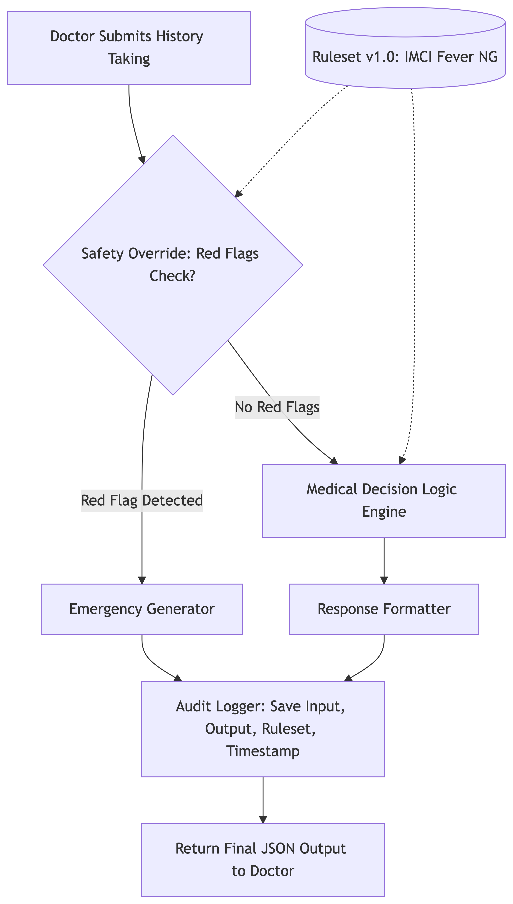

# AwaDoc CDST — Clinical Decision Support Tool

A deterministic, auditable triage engine for **Febrile illness in a child under 5**, calibrated for Nigerian primary-care and outpatient settings.

> ⚠️ **Non-diagnostic.** This service surfaces structured recommendations for clinician review. It does not autonomously diagnose, prescribe, or order treatment. The clinician is the decision-maker.

---

## Architecture

```
HTTP POST /v1/encounters/triage
   ↓
[DTO validation (class-validator)]   reject clinically impossible inputs (400)
   ↓
[Rules engine — pure, synchronous]
   ├── Safety override (red flags → Emergency, non-negotiable)
   ├── Differential ranking (baseWeight + structured-predicate modifiers, normalized)
   ├── Triage level (Emergency / Urgent / Semi-Urgent / Routine)
   └── Missing-information checks
   ↓
HTTP 200 response (includes auditId)
   ↓ (fire-and-forget)
[Bull queue → Redis]
   ↓
[Audit worker → MongoDB immutable record]
```



Why this shape:
- **No LLM in the critical reasoning loop.** Hallucinations are fatal in clinical triage.
- **In-memory frozen ruleset.** Microsecond latency at the point of care.
- **Async audit persistence.** DB writes never block the clinician.
- **Structured predicates (no `eval()`).** Safe to defend in code review.

See [`docs/AUDIT_DESIGN.md`](docs/AUDIT_DESIGN.md) for the medico-legal accountability model, [`docs/CLINICAL_RATIONALE.md`](docs/CLINICAL_RATIONALE.md) for clinical sourcing, and [`docs/API.md`](docs/API.md) for endpoint specs with three full scenarios.

---

## Tech Stack and why

Every dependency was chosen deliberately. Clinical software is a "would I defend this in a code review" exercise, not a "what's trendy" exercise.

| Layer | Choice | Why |
|---|---|---|
| Language | **TypeScript** | A clinical engine must catch shape errors at compile time, not in production. Discriminated unions on the `Predicate` type let the compiler exhaustively verify that every operator is handled — adding a new operator without a `switch` arm is a compile error, not a runtime surprise. |
| Framework | **NestJS 10** | Opinionated structure (modules, controllers, providers) maps cleanly to the layered architecture this CDST needs: DTO → service → engine → audit. The DI container makes the rules engine trivially mockable for tests, and `@Module` boundaries make it obvious where the deterministic core ends and the I/O layer begins. |
| Validation | **class-validator** + **class-transformer** | DTO decorators (`@Min`, `@Max`, `@IsEnum`, `@ValidateNested`) reject clinically impossible inputs (e.g. `temperatureC: 500`, `ageMonths: -5`) with HTTP 400 *before* the engine sees them. The validator schema mirrors the ruleset's `inputSchema` 1:1, so the contract is enforced in two places that cannot drift apart. |
| API docs | **@nestjs/swagger** | The "Web App" deliverable. Swagger UI is generated from the same DTOs that validate the request, so the published contract and the enforced contract can never diverge. Reviewers can drive the three documented scenarios from `/docs` with one click. |
| Database | **MongoDB** (via **Mongoose**) | Audit records store the full validated `input` and full engine `output` as nested JSON — exactly the shape Mongo represents natively. `strict: 'throw'` on the schema rejects unknown fields, and indexes on `auditId`, `sessionId`, `clinicianId`, `evaluationPath`, `triageLevel` cover every audit-query path the governance committee will need. |
| Queue | **Bull** on **Redis** | The clinician's response must not be blocked by MongoDB latency. Bull gives us exactly what audit needs: exponential-backoff retries, a unique-id idempotency primitive (`auditId` carries `unique: true`), and `removeOnFail: false` so failed jobs survive forever for medico-legal replay. Redis is a single in-memory dependency, sub-millisecond enqueue. |
| Identifiers | **ULID** | Audit IDs are sortable: lexicographic order = chronological order. Range-querying `db.encounters.find({ auditId: { $gte: enc_X, $lte: enc_Y } })` works without a secondary timestamp index. |


### What was deliberately not chosen, and why

- **An ORM with a strict schema layer (Prisma, TypeORM) for the audit collection.** The audit's `input` and `output` fields are unstructured JSON by design — they store whatever the engine produced for the version of the ruleset that was active. A migration-driven schema would fight that. Mongoose with `Object`/`Mixed` for those two fields plus `strict: 'throw'` for the rest gives us the right balance.
- **A rules-DSL library (jsonata, json-rules-engine, Drools-style).** The expression surface here is small (10 operators). A 60-line hand-rolled evaluator with structured `{ field, op, value }` predicates is more auditable than a dependency, ships zero security surface area (no `eval()`, no DSL parsing), and renders human-readable `triggeredBy` strings into the audit trail without a separate code path.
- **An LLM in the critical reasoning loop.** This is the single most consequential choice. The differential ranking, triage level, and safety override are all deterministic functions of a frozen ruleset and a validated DTO. An LLM (Noura) is bolted on at the *interface* — see [`docs/BONUS_NOURA_INTEGRATION.md`](docs/BONUS_NOURA_INTEGRATION.md) — but it never decides the triage.
- **GraphQL.** The contract is one POST endpoint plus two simple audit endpoints. REST + Swagger is faster to specify, faster to test, and easier for an EMR integration team to consume.

---

## Setup

**Prerequisites:** Node.js 20+, Docker, and Docker Compose.

```bash
# 1. Bring up Mongo + Redis
docker-compose up -d

# 2. Install dependencies
npm install

# 3. Copy env (defaults work for the docker-compose stack)
cp .env.example .env

# 4. Start in watch mode
npm run start:dev
```

The API listens on `http://localhost:3000`. The Web App deliverable is the interactive **Swagger UI at `http://localhost:3000/docs`** — use the “Try it out” button to send the three sample scenarios in [`docs/API.md`](docs/API.md).

---

## Running the tests

A single command:

```bash
npm test
```

Expect **30 passing tests** across 4 suites:
- **HTTP integration** (`triage.http.spec.ts`) — golden path, safety override, and DTO validation rejection over a real NestJS HTTP server
- **Safety override** (`safety-override.spec.ts`) — 6 tests including contradictory inputs and non-escalation
- **Rules engine** (`rules-engine.spec.ts`) — differential ranking, triage thresholds, and a 1 000-iteration determinism assertion
- **Predicate evaluator** (`predicate-evaluator.spec.ts`) — operator coverage and a structural assertion that the source contains no `eval()` or `new Function()`

---

## Inspecting the audit trail

```bash
# Show all encounters
docker exec -it awadoc-mongo mongosh awadoc --eval 'db.encounters.find().pretty()'

# Find emergency-pathway audits
docker exec -it awadoc-mongo mongosh awadoc --eval 'db.encounters.find({ evaluationPath: "safety-override" }).pretty()'
```

Record clinician disposition (accepted / ignored / overridden) by calling:

```
PATCH /v1/encounters/:auditId/disposition
```

See [`docs/AUDIT_DESIGN.md`](docs/AUDIT_DESIGN.md) for the full disposition contract.

---

## Project layout

```
awadoc-cdst/
├── docker-compose.yml                  Mongo + Redis
├── rulesets/
│   └── febrile-child-under-5/
│       └── v1.0.0-IMCI-NG.json         Clinical content (versioned, immutable)
├── src/
│   ├── main.ts                         Bootstrap + Swagger
│   ├── app.module.ts
│   ├── common/
│   │   ├── dto/                        Strict class-validator DTOs
│   │   └── filters/                    Global exception filter
│   ├── triage/
│   │   ├── engine/                     Pure rules engine (no I/O)
│   │   │   ├── types.ts
│   │   │   ├── predicate-evaluator.ts
│   │   │   ├── safety-override.ts
│   │   │   ├── ruleset-loader.ts
│   │   │   └── rules-engine.ts
│   │   ├── triage.controller.ts        POST /v1/encounters/triage
│   │   ├── triage.service.ts
│   │   ├── triage.module.ts
│   │   └── __tests__/                  30 tests — unit + HTTP integration, runnable via `npm test`
│   └── audit/
│       ├── audit.controller.ts         GET + PATCH disposition
│       ├── audit.processor.ts          Bull worker → MongoDB
│       ├── audit.service.ts            Enqueue helper
│       ├── audit.module.ts
│       └── schemas/encounter-audit.schema.ts   Immutable Mongoose doc
└── docs/
    ├── API.md                          Endpoint spec + 3 sample scenarios
    ├── CLINICAL_RATIONALE.md           ≤ 500-word clinical defence
    ├── AUDIT_DESIGN.md                 Medico-legal accountability writeup
    ├── BONUS_NOURA_INTEGRATION.md      Conversational AI layer sketch
    └── SUBMISSION_NOTE.md              Email body, ready to paste
```

---

## Out of scope (deliberate)

- **Authentication and multi-tenancy.** Production needs OAuth2 + hospital-tenant scoping; not implemented here.
- **Frontend beyond Swagger.** Web App deliverable = the Swagger UI.
- **LLM in the reasoning loop.** Deliberately omitted; see [`docs/BONUS_NOURA_INTEGRATION.md`](docs/BONUS_NOURA_INTEGRATION.md) for how Noura sits *outside* the engine.
- **Outcome-calibrated probability weights.** The current `v1.0.0-IMCI-NG` weights are clinically reasoned seed values, not statistically derived. See the provenance section of the ruleset JSON and [`docs/CLINICAL_RATIONALE.md`](docs/CLINICAL_RATIONALE.md).
