# NouraCDS — System Architecture

**AI-Powered Clinical Intelligence & Decision Support Platform**

> Source requirements: the NouraCDS PRD (v1.0).

---

## 1. Overview & Goals

NouraCDS gives every frontline health worker in Africa — doctors, nurses, CHEWs, pharmacists — access to safe, evidence-based, multilingual clinical decision support, regardless of facility level or connectivity. Hospitals, pharmacies, and medical centres onboard as **tenants**; their staff log in and are shown only the parts of the clinical workflow their role permits.

The central engineering problem is a tension that this architecture exists to resolve:

> We need answers that are **broad and scalable** (the long tail of presentations, languages, and questions a clinician will throw at it) while remaining **deterministic, reliable, and medico-legally defensible** (the same input must produce the same, explainable, guideline-backed output that a clinician can stand behind in court).

A pure LLM is broad but not reproducible or defensible. A pure rule engine is reproducible and defensible but cannot scale to every presentation. NouraCDS resolves this with one organising principle, applied everywhere:

> ### "AI proposes, the deterministic core disposes."

The LLM is used aggressively for what it is good at — understanding messy human input, retrieving relevant guidance, and producing natural language — and is **structurally prevented** from being the final authority on anything that can harm a patient. Every safety-critical decision is owned by a deterministic engine, and every AI-generated output is gated by that engine and fully traced.

### Design goals

| Goal | How the architecture delivers it |
|------|----------------------------------|
| Diagnostic accuracy & guideline adherence | Deterministic rulesets translated from WHO/IMCI/iCCM/FMOH; RAG grounded in the same corpus with citations. |
| Patient safety | Non-negotiable deterministic safety tier (red flags, scope-of-practice, drug safety) the LLM cannot override. |
| Defensibility | Immutable, append-only audit; every decision pins ruleset + model + prompt + corpus versions and records the full trace. |
| Reduced consultation time | Microsecond deterministic path; response + extraction caching; AI transport removes documentation burden. |
| Multilingual reach | AI transport layer (STT/TTS/translation) on both ends, decoupled from clinical reasoning. |
| Scope-aware UX | RBAC + scope-of-practice render only role-relevant schema sections and enforce them server-side. |
| Scale to new conditions | Versioned ruleset registry (Tier 2) + RAG long tail (Tier 3) without re-architecting. |

---

## 2. Architecture Principles

1. **The deterministic core owns safety.** Red-flag escalation, scope-of-practice, and drug-safety limits are computed by deterministic rules with no `eval()` and no LLM in the path. They are reproducible and unit-tested.
2. **AI is gated and observable.** No AI output reaches a clinician without passing the Clinical Guardrail Engine, and every AI call is traced (inputs, retrieved sources, model + prompt version, latency, cost, verdict).
3. **Human-in-the-loop on decisions, not on data entry.** Extracted input is validated against the strict clinical schema (invalid / out-of-range values rejected) and passed straight to the orchestrator — there is no manual "confirm the extracted data" step. Human oversight applies to the *clinical output*, which is advisory and requires the clinician to accept/modify. NouraCDS never autonomously diagnoses, prescribes, or treats.
4. **Immutable audit.** Encounters are append-only. Inputs, outputs, and version pins are never mutated; only disposition is appended.
5. **Versioned everything.** Rulesets, prompts, models, and the knowledge corpus are versioned artifacts. A record is reproducible because it pins the exact versions used.
6. **Provider-agnostic AI.** All model access flows through an LLM gateway so Claude / OpenAI / local / ElevenLabs / Whisper are swappable by configuration.
7. **Multi-tenant & least-privilege.** Every record is tenant-scoped; every action is checked against the actor's role and scope.
8. **Privacy by design (NDPR/NDPA).** PHI is encrypted in transit and at rest, prompt logs are redacted, and the design supports in-region data residency.
9. **Online-first, gracefully degrading.** The MVP assumes connectivity; the PWA caches the app shell and recent encounters for read-only resilience. Offline-first sync is a later phase.

---

## 3. System Context Diagram

*The whole platform as a single box — who uses it and which outside systems it talks to.*

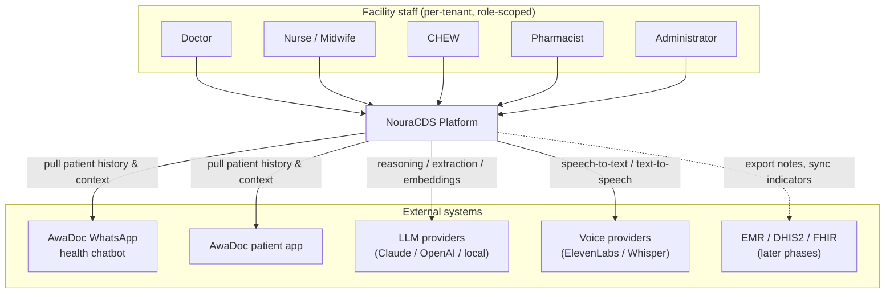

A patient who already uses AwaDoc's WhatsApp bot or app has history we can pull into an encounter for richer context. Facilities and their staff are the direct users; external AI providers sit behind the gateway; EMR/DHIS2/FHIR integration arrives in later phases.

---

## 4. High-Level Component / Layer Architecture

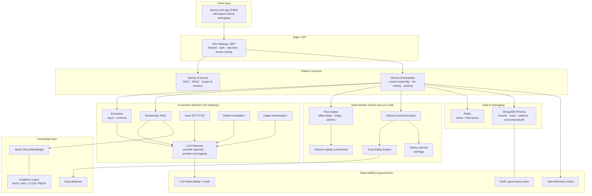

The **Clinical Orchestrator** is the heart of the runtime: it assembles patient context, routes each request to the correct reasoning tier, runs the guardrail, caches, persists the audit, and returns the clinical brief. The AI services and the deterministic core are deliberately separate subsystems — the orchestrator is the only thing that talks to both.

---

## 5. The 3-Tier Reasoning Model

Decisions are classified by **how much harm a wrong answer can do**, and routed accordingly.

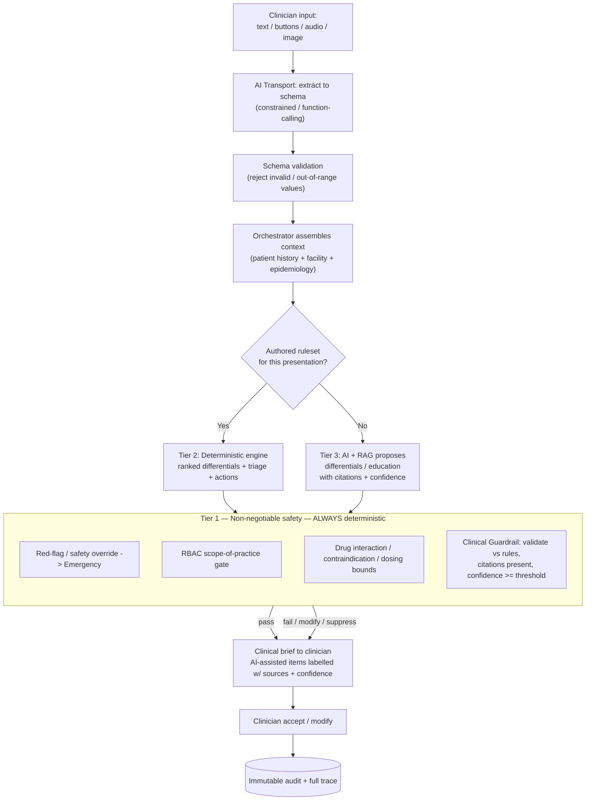

### What each tier may and may not do

| | **Tier 1 — Safety** | **Tier 2 — Authored conditions** | **Tier 3 — Long-tail breadth** |
|---|---|---|---|
| Authority | Deterministic, absolute | Deterministic primary | AI primary, rule-gated |
| Produces | Red-flag escalation, scope gate, drug-safety verdicts | Ranked differentials, triage level, recommended actions | Candidate differentials, investigations, patient education |
| LLM role | **None** | Explains & translates only | Proposes, grounded in RAG |
| May override a red flag? | — (it *is* the red flag) | No | No |
| May exceed role scope? | No (it enforces scope) | No | No |
| Reproducible? | Yes (byte-identical) | Yes (byte-identical) | Inputs/sources/versions traced; output labelled "AI-assisted" |
| Failure mode | Fail safe (escalate) | Fall back to Tier 3 if no ruleset | Guardrail can suppress/modify; clinician verifies |

**Routing rule (simplified):** the orchestrator matches the validated presentation (chief complaint + demographics) against the ruleset registry's `appliesTo`. A match → Tier 2. No match → Tier 3. In **all** cases the output passes Tier 1 before display. Tier 1 runs *first* for red flags (an Emergency short-circuits to escalation regardless of tier) and *last* for the guardrail quality check.

### How this maps to the AI-layer spec

The same model, expressed in the AI engineer's component language: a deterministic **Safety Classifier** runs *before* the LLM (our Tier-1 red-flag override), the LLM may call only **required deterministic tools** (rule engine, RAG, drug lookup — our Tier-2) plus optional augmentation tools, and a deterministic **Role Guardrail** runs *after* the LLM (our Tier-1 guardrail). In other words, "Safety Classifier" ≡ our **Safety Override** and "Role Guardrail" ≡ our **Clinical Guardrail Engine**.

Internally the AI reasoning is organised as **per-role agents** (doctor / nurse / CHEW / pharmacist), each composed of **event handlers** (e.g. `differentials`, `investigations`, `treatment_plan`, `drug_safety`, `soap_note`). Handlers run in **dependency waves**, not a flat batch: independent handlers run first; dependent handlers wait only for the specific outputs they consume. If a dependency failed after its retry, the dependent handler proceeds with reduced context and is labelled **low-confidence** rather than blocking the whole encounter.

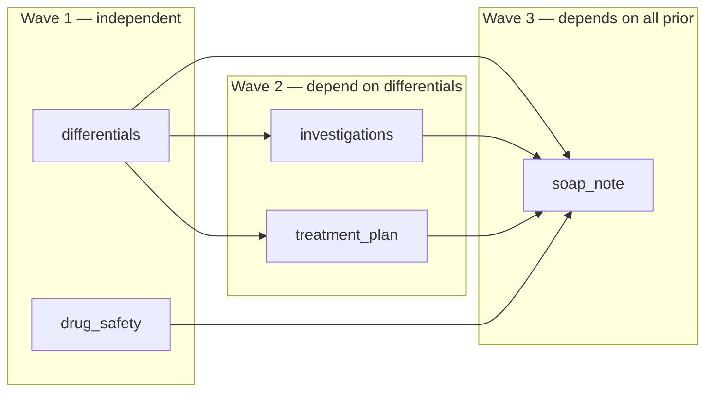

### Context trust grading

Not all context is equally trustworthy, so every field carried into reasoning is **graded**, and the grade constrains how it may be used:

| Grade | Source | Usage rule |
|-------|--------|------------|
| **VERIFIED** | Clinician-entered data | Primary clinical evidence |
| **REPORTED** | AwaDoc WhatsApp bot / patient intake | Supporting only; never the sole basis for a recommendation |
| **HISTORICAL** | Past encounters / prior diagnoses | Background awareness only |
| **INFERRED** | Calculated values (BMI, age group, risk flags) | Supplementary signal |

This makes the AwaDoc/WhatsApp pull from Section 3 explicit: pulled patient data enters as **REPORTED** — it can enrich reasoning but can never, on its own, drive a clinical recommendation.

---

## 6. Identity, RBAC & Scope-of-Practice

Authentication is OIDC (authorization-code + PKCE for the web app); the BFF validates JWTs and resolves the actor's tenant, role, and scope. Authorization is **two-layered**:

- **RBAC** — coarse: which modules/endpoints a role may call.
- **Scope-of-practice** — fine: which *clinical actions* a role may take, enforced inside the deterministic core (Tier 1) so the LLM can never grant an out-of-scope action.

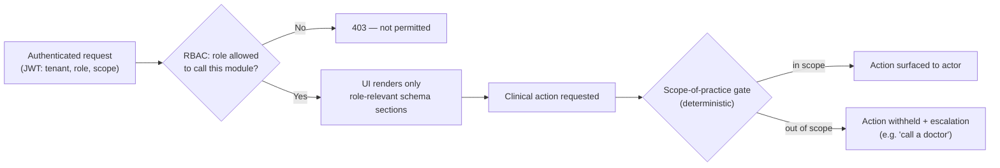

### Role matrix

| Role | RBAC modules | Scope-of-practice (Tier-1 enforced) | Schema sections shown |
|------|--------------|--------------------------------------|------------------------|
| **Doctor** | All clinical modules | Clerk, diagnose, prescribe, manage emergencies | Full clerking + diagnosis + treatment |
| **Nurse / Midwife** | Workspace, triage, maternal, drug-safety (read) | Restricted prescribing; **must escalate emergencies to a doctor**; maternal/neonatal care | History, exam, triage, maternal; treatment read-only/restricted |
| **CHEW** | Workspace (IMCI/iCCM), triage | Scope-limited recommendations; **stabilize-and-refer**; no physician-only actions | Guided IMCI/iCCM intake, triage, referral |
| **Pharmacist** | Drug-safety, counseling | Drug interactions, contraindications, adherence; no diagnosis | Medication, interactions, counseling |
| **Administrator** | Dashboards, analytics, user management | No clinical actions | Facility dashboard, audit review |

The same scope rules are applied on the **frontend** (to hide what a role cannot do) and authoritatively on the **backend** (so a tampered client cannot bypass them). Treatment plans returned by the engine are filtered to the actor's scope — e.g. a CHEW receives "stabilize and refer" where a doctor receives the full management plan.

---

## 7. AI Services & the LLM Gateway

All model access flows through a single **provider-agnostic gateway** so models are swappable by config and every call is logged, versioned, and cost-tracked.

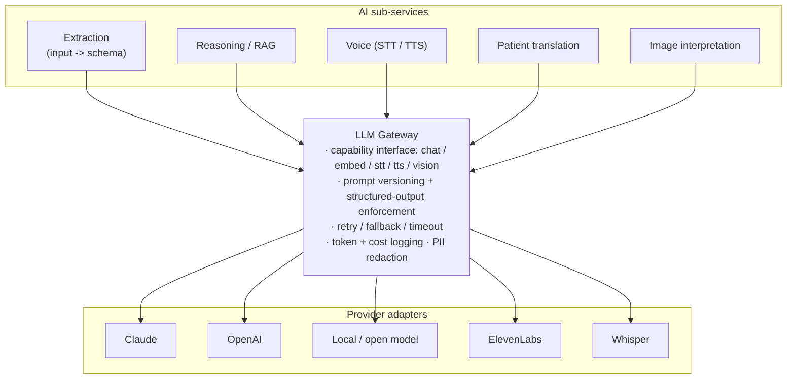

- **Extraction** turns free text / button answers / audio transcript / image findings into the strict clinical schema using constrained decoding / function-calling bound to the input contract. Its output is **validated against the schema** (invalid / out-of-range values rejected) and passed straight to the orchestrator — there is no manual confirmation step.
- **Reasoning / RAG** (Tier 3 only) retrieves guideline passages and produces a schema-constrained proposal with citations + confidence.
- **Voice** (ElevenLabs / Whisper) and **Patient translation** implement PRD Modules 7 & 8 — multilingual STT/TTS and conversion of clinical language to patient-friendly language. Phase 1 languages: English, Hausa, Yoruba, Igbo; Phase 2: Pidgin, French, Swahili.
- **Image interpretation** (PRD Module 9) handles skin/wounds/rashes first, lab/radiology reports later; its findings feed extraction, never the final decision.

None of these services decide clinical outcomes — they are transport and proposal only, gated downstream.

### AI-layer I/O contract: ContextPayload → ClinicalBrief

The orchestrator and the AI services communicate over a single versioned contract:

- **ContextPayload (in)** — `metadata` (encounter / tenant / facility, role, requested outputs, versions), `patient` (internal reference + non-PHI demographics: age, sex, weight, pregnancy), `clinical_context` (role-specific VERIFIED data), and optional `graded_context` (REPORTED / HISTORICAL / INFERRED).
- **ClinicalBrief (out)** — `status` (COMPLETE / PARTIAL / FAILED), `escalation_triggered` + `escalation_reason`, per-event `outputs` (each a gated output or a failure record), `failed_outputs`, an `ai_label` ("AI-assisted"), and the version pins (`prompt_versions`, `model_version`, `corpus_version`) plus `generated_at`.

The version pins carried on the ClinicalBrief are what make the persisted encounter reproducible.

### Handler pipeline

Every handler follows the same sequence; missing required-tool context fails the handler **before** the LLM is ever called (fail-closed):

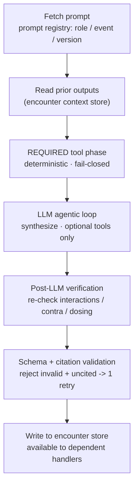

- **Required vs optional tools.** Required tools (RAG, rule engine, drug lookup, interaction/contraindication checks) run *unconditionally and deterministically*; the LLM may call only optional augmentation tools. The LLM can never skip a required safety check.
- **Prompt registry.** Prompts are versioned artifacts addressed as `prompts/<role>/<event>/v<x.y.z>`, and the version used is pinned per output in the ClinicalBrief.

### Role-scoped tool access

Tool access is itself role-scoped — defense in depth alongside edge RBAC (Section 6) and the guardrail's scope check:

| Tool | Doctor | Nurse | CHEW | Pharmacist |
|------|:------:|:-----:|:----:|:----------:|
| General clinical RAG | full | full | — | — |
| Maternal / neonatal RAG | full | full | — | — |
| IMCI / iCCM index + rules | — | — | full | — |
| Drug lookup + safety | full | read | — | full |
| Local epidemiology | full | full | full | — |

---

## 8. RAG / Knowledge Pipeline

Tier 3 is only as safe as its grounding. The knowledge pipeline curates, versions, and indexes guideline content so every AI proposal can cite a real source.

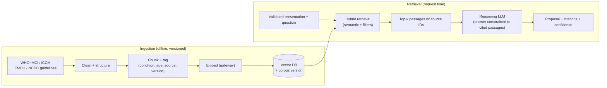

Key properties: the corpus is a **versioned artifact** (a record pins the corpus version it used); retrieval is filtered by condition/age/role so a paediatric query never grounds on adult guidance; and the reasoning prompt requires the model to answer **only** from retrieved passages and to surface citations — answers it cannot ground are flagged low-confidence and caught by the guardrail.

---

## 9. Deterministic Clinical Core

This is the defensible heart of the system — pure functions, no I/O, no `eval()`, fully unit-tested, packaged as a shared library (`packages/engine`) reused by the API and by offline/edge deployments later.

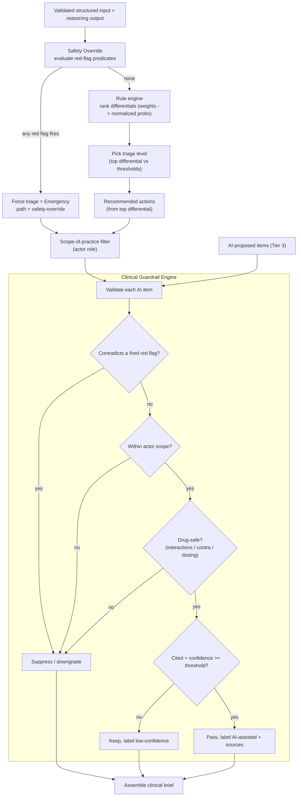

Components:

- **Rule engine** — weight-based differential ranking normalised to probabilities, deterministic tie-breaking, triage-level selection against ruleset thresholds, and "missing info" prompts. Same input + same ruleset = byte-identical output.
- **Safety Override** — red-flag predicates that force **Emergency** regardless of differential ranking; non-negotiable.
- **Clinical Guardrail Engine** — the quality check on **all** AI output: rejects/suppresses anything that contradicts a red flag, exceeds the actor's scope, or fails drug safety; labels the rest with confidence and citations. This is the gate that makes Tier 3 safe.
- **Drug Safety Engine** (PRD Module 5) — interactions, contraindications, pregnancy safety, paediatric dosing, duplicate-therapy detection; consulted by the guardrail and callable directly by pharmacists.
- **Ruleset registry** — versioned, immutable ruleset files (one per condition), loaded at boot and frozen. New clinical content ships as a new version; old versions are never edited or deleted.

### Safety Classifier routing (pre-AI)

The Safety Classifier (our Safety Override, run *before* the LLM) categorises danger signs — neurological, respiratory, obstetric, paediatric, sepsis/red-flag, surgical/abdominal — and routes by role + acuity:

| Condition | Behaviour |
|-----------|-----------|
| CHEW + CRITICAL | **Stop.** Attach the emergency flag and return an immediate-referral brief — do not run AI synthesis. |
| Doctor / Nurse + CRITICAL | Attach the emergency flag and continue with an emergency-escalation prompt. |
| No emergency | Continue normally. |

### Guardrail failure modes (post-AI)

The Clinical Guardrail Engine (Role Guardrail, run *after* the LLM) resolves each issue deterministically:

| Trigger | Action |
|---------|--------|
| Danger sign detected | Force escalation; override the LLM output. |
| Low confidence | Label the item LOW; do not suppress. |
| Scope violation | Withhold the action; surface an escalation prompt. |
| Drug-safety flag | Suppress until resolved / acknowledged. |
| Missing citation | Suppress the uncited claim. |

---

## 10. Caching

Caching cuts latency and cost and reinforces determinism. Two caches on Redis:

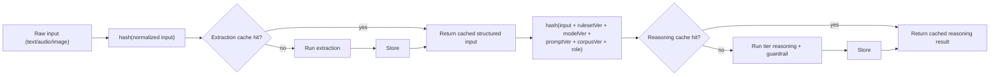

- **Extraction cache** keyed on the normalised raw input — identical dictation/text need not be re-processed.
- **Reasoning cache** keyed on the **full version fingerprint**. Because deterministic-engine output is a pure function of `(input, ruleset)`, it is trivially cacheable. AI output is also cached but **any** version bump (model, prompt, corpus, ruleset) changes the key and invalidates stale entries — so a model upgrade can never silently serve outdated reasoning.
- **Request idempotency.** The reasoning-cache key doubles as the AI-layer idempotency key — `hash(role + sanitized ContextPayload + prompt_version + corpus_version)`. Concurrent identical requests are de-duplicated **in-flight** (the second waits on the first) rather than running the model twice.

---

## 11. End-to-End Clerking Sequence

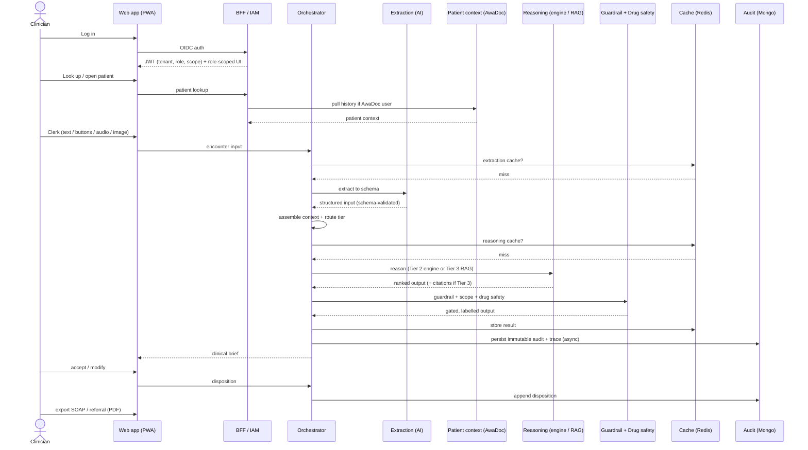

The clinician's perceived latency is dominated by extraction + reasoning; audit persistence is asynchronous (queued) so it never blocks the response.

---

## 12. Data Model

Modelled with **Prisma on MongoDB**. Encounters are immutable audit records; only disposition is appended.

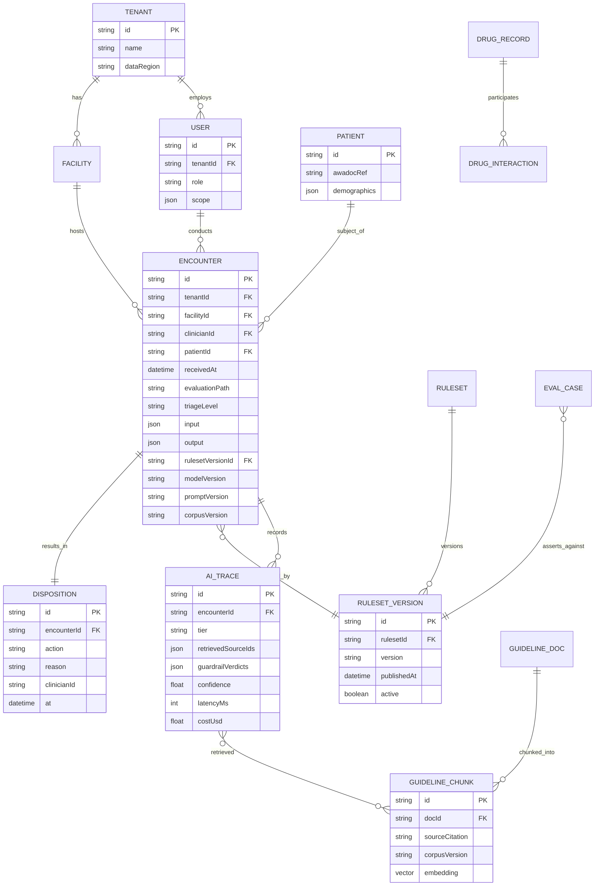

The `ENCOUNTER` record carries everything needed to reproduce and defend a decision: the full validated `input`, the full `output`, and the exact `rulesetVersion` / `modelVersion` / `promptVersion` / `corpusVersion` used. `AI_TRACE` captures the per-decision observability detail (tier, retrieved sources, guardrail verdicts, confidence, latency, cost). `DISPOSITION` is the only thing appended after creation (`accepted` / `modified` / `overridden`, with reason).

---

## 13. Observability & AI Governance

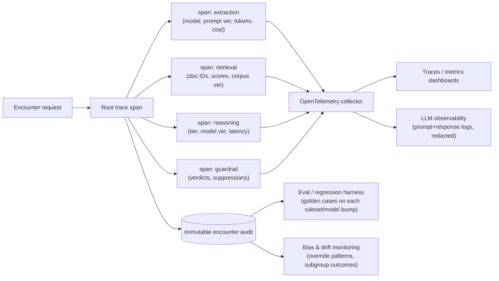

| Requirement | Mechanism |
|-------------|-----------|
| Human-in-the-loop | Accept/modify on the clinical output; advisory-only outputs |
| Explainable outputs | Per-differential rationale; triggered modifiers; cited passages |
| Guideline citations | RAG citations + ruleset provenance pinned per record |
| Confidence scoring | Differential probabilities (Tier 2) + model confidence (Tier 3) |
| Audit trails | Immutable `ENCOUNTER` + `AI_TRACE` |
| Prompt logging | Gateway logs prompts/responses (PII-redacted), versioned |
| Bias monitoring | Override-pattern + subgroup-outcome dashboards; eval harness on each version bump |

### Evaluation targets

The eval / regression harness gates every version bump against these thresholds; uncertain cases route to a clinician for human review:

| Metric | Target |
|--------|--------|
| Safety-classifier sensitivity (danger-sign detection) | ≥ 99% |
| Guardrail precision | ≥ 99% |
| Clinical accuracy (top differential) | ≥ 95% |
| RAG relevance | ≥ 90% |

### Performance targets

| Stage | Budget |
|-------|--------|
| Schema validation | < 20 ms |
| Safety classifier | < 50 ms |
| Required tool phase | < 500 ms |
| LLM agentic loop | < 2500 ms (p95) |
| Post-LLM verification | < 200 ms |
| Guardrail | < 100 ms |
| Total request (fresh) | < 3500 ms (p95) |
| Total request (cached) | < 200 ms |

---

## 14. Integrations

| Phase | Integration | Direction | Purpose |
|-------|-------------|-----------|---------|
| 1 | AwaDoc WhatsApp bot | Inbound | Pull existing patient history into an encounter |
| 1 | AwaDoc app | Inbound | Pull patient demographics & history |
| 2 | EMR / FHIR | Bidirectional | Import context, export notes |
| 2 | DHIS2 | Outbound | Export aggregate indicators for public-health intelligence |
| 3 | Hospital / national systems | Bidirectional | Deeper interoperability |

Integrations are implemented as **adapters** behind a stable internal patient-context interface, so the orchestrator does not care whether context came from WhatsApp, the app, or an EMR.

---

## 15. Deployment Topology

Cloud-agnostic, containerised, NDPR/NDPA-aware.

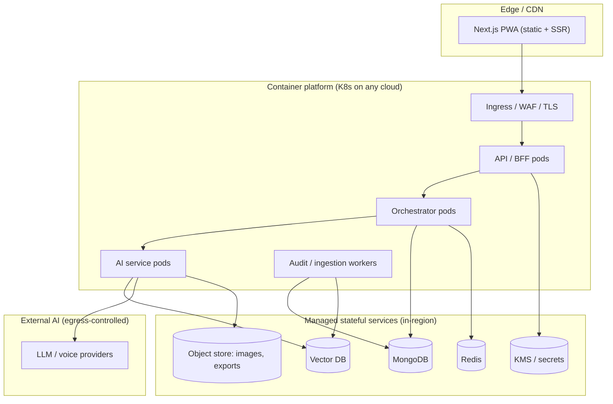

Stateful services are deployable in-region for data residency; AI-provider egress is controlled and PII-redacted. Hospitals requiring on-prem can run the deterministic core + cached rulesets locally (a later-phase option), aggregating de-identified indicators centrally.

---

## 16. Security & Compliance

- **Transport & storage encryption** — TLS everywhere; encryption at rest for MongoDB, object store, and backups; keys in KMS.
- **PHI minimisation** — only required fields leave the platform; prompts sent to AI providers are redacted of direct identifiers where feasible; image/audio stored in access-controlled object storage.
- **NDPR / NDPA alignment** — lawful basis, data-subject rights support, retention policy, and in-region residency path.
- **Access control** — tenant isolation on every query; least-privilege roles; audit-log access restricted and itself audited.
- **Auditability** — append-only encounters; deployment changes, ruleset promotions, and prompt-version changes are logged.
- **Secrets** — no secrets in code; injected from KMS/secret manager per environment.

---

## 17. Technology Stack

| Layer | Choice | Notes |
|-------|--------|-------|
| Backend / API | **NestJS (TypeScript)** | Modular, DI, Swagger; hosts BFF, orchestrator, AI service clients |
| Frontend | **Next.js + React + Tailwind**, PWA | Role-based clinical workspace; offline app-shell caching |
| Data / ORM | **Prisma on MongoDB** | Tenants, users, patients, immutable encounters/audit |
| Cache & queue | **Redis + Bull** | Extraction/reasoning caches; async audit + ingestion jobs |
| Vector DB | Qdrant / pgvector / Atlas Vector | RAG embeddings; chosen at build time |
| AI access | **Provider-agnostic LLM Gateway** | Claude / OpenAI / local + ElevenLabs / Whisper adapters |
| Auth | OIDC (Keycloak / managed IdP) | JWT at BFF; RBAC + scope-of-practice |
| Observability | OpenTelemetry + LLM-observability (e.g. Langfuse-style) | Traces, prompt logs, evals, dashboards |
| Packaging / deploy | Docker + Kubernetes, cloud-agnostic | In-region stateful services; IaC |

---

## 18. Alignment Notes / Open Divergences with the AI-Layer Spec

This architecture is aligned with the AI engineer's *AI Layer Architecture v1.0* on every clinical-reasoning concept above — trust grading, the ContextPayload → ClinicalBrief contract, per-role agents + handler dependency waves, pre/post deterministic safety, required-vs-optional tools, and the eval + performance targets. Our **locked platform decisions are unchanged**: NestJS/TypeScript, Prisma + MongoDB, a provider-agnostic LLM gateway, and a Next.js PWA.

The items below are **open implementation divergences** between this document and the AI engineer's build. They are recorded here to be reconciled with the engineer — not resolved in this document:

| Topic | This document | AI-layer spec | Note |
|-------|---------------|----------------|------|
| AI-layer runtime | AI services within the NestJS platform | Separate **FastAPI / Python** service | The AI layer may ship as its own Python service behind the same ContextPayload → ClinicalBrief contract; the boundary is identical either way. |
| AI-layer datastores | MongoDB (platform) | **Supabase / Postgres** (drug, knowledge, AI audit) + Redis context store | A genuine difference: decide whether the AI layer uses its own Postgres or the platform's MongoDB. |
| Vector store | Agnostic (Qdrant / pgvector / Atlas), chosen at build time | **Pinecone** | Not a conflict — Pinecone is a concrete choice for a slot this document left open. |
| LLM observability | OpenTelemetry + LLM-observability | **Langfuse** | Not a conflict — Langfuse fits the open "LLM-observability" slot. |

Of these, **runtime language** and **AI-layer datastore** are the two that need an explicit decision with the AI engineer; the vector store and observability tool simply fill slots this document intentionally left open.

---