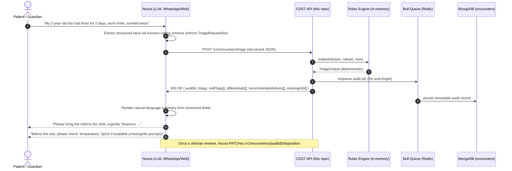

# Bonus — Noura Conversational Layer over the CDST Engine

This sketch answers the question: *how would a conversational AI assistant (Noura) call this deterministic CDST engine?*

The single principle: **the LLM lives outside the reasoning loop.** It shapes inputs and renders outputs as natural language, but it never decides the triage level, never reorders the differential, never invents a recommended action. The engine remains deterministic; the LLM is an interface.

---

## Sequence diagram



---

## Design notes

### 1. The boundary is the DTO

The LLM exposes a **function-calling tool** whose JSON schema is generated directly from `TriageRequestDto`. The model cannot return fields the DTO doesn't accept; the DTO's `forbidNonWhitelisted: true` validator will reject any drift. This makes the LLM's behaviour bounded by the schema — it can fail to capture a field, but it cannot invent one.

Pseudocode (Anthropic SDK style):

```ts
const tools = [{
  name: 'submit_paediatric_febrile_triage',
  description: 'Call the deterministic CDST engine with structured paediatric febrile inputs.',
  input_schema: jsonSchemaFor(TriageRequestDto), // generated, not hand-written
}];

const completion = await anthropic.messages.create({
  model: 'claude-sonnet-4',
  system: NOURA_TRIAGE_SYSTEM_PROMPT, // includes IMCI question order + safety language
  tools,
  tool_choice: { type: 'tool', name: 'submit_paediatric_febrile_triage' },
  messages: conversationHistory,
});

const dto = completion.content.find(c => c.type === 'tool_use').input;
const triageResponse = await fetch('http://cdst/v1/encounters/triage', {
  method: 'POST', body: JSON.stringify(dto)
}).then(r => r.json());
```

### 2. The engine's `missingInfo` array is the LLM's next question

Every triage response carries a `missingInfo[]` array. Noura uses these prompts to drive the *next conversational turn*. The clinical question order is the engine's, not the LLM's:

> Engine says `MI_RR_FOR_COUGH` is missing → Noura asks: *"Could you count the child's breathing for 60 seconds and tell me the number?"*

The LLM never decides what to ask next; the engine surfaces the gap.

### 3. Audit captures the structured JSON, not the conversation

The audit record stores the validated DTO as `input`. The free-text conversation transcript lives in Noura's session log, separate from the medico-legal audit. This separation is deliberate:

- **What the engine reasoned about** is the structured JSON — and that is reproducible.
- **What the patient actually said** is the chat transcript — useful for QA but not for medico-legal reconstruction.

### 4. The safety override remains untouchable

Even if the LLM somehow returns `{"redFlagsObserved": {"convulsions": true}}` because of a hallucination or misunderstood input, the engine evaluates this deterministically: red flag fires, triage forced to Emergency. The LLM cannot *suppress* a danger sign by phrasing it differently — the engine looks at booleans, not prose.

The inverse safety property holds too: if the LLM omits a danger sign the patient described, the engine will under-triage. That is why the LLM's system prompt explicitly enumerates IMCI general danger signs and asks Noura to verify each before submitting.

### 5. What this architecture is *not*

- **Not RAG.** The engine does not retrieve from an LLM-readable knowledge base; it evaluates structured predicates against a frozen JSON file.
- **Not a chained agent.** No tool-using agent loop. One LLM extraction call → one deterministic engine call → one LLM rendering call. The control flow is linear.
- **Not a black box.** Every recommendation surfaced to the patient or clinician is traceable back to a specific differential id and a specific modifier id in the audited ruleset version.

This is exactly the boundary AwaDoc describes between Noura and the deterministic reasoning layer: **AI as an interface, never as the decision-maker.**
