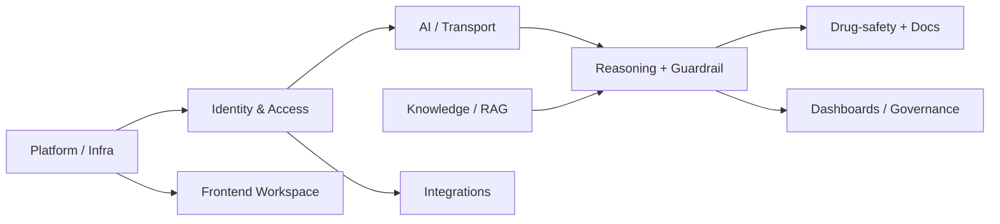
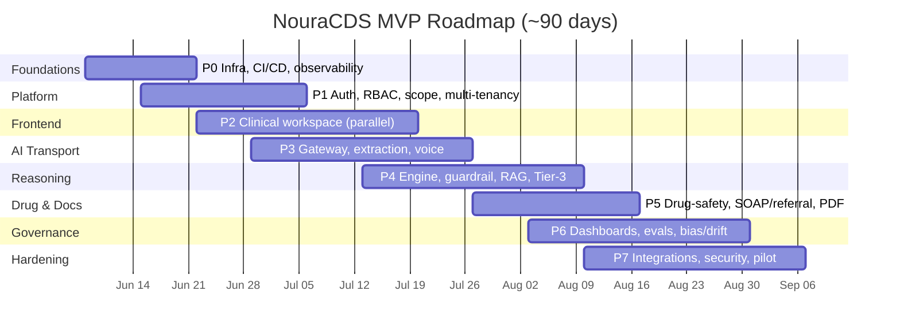
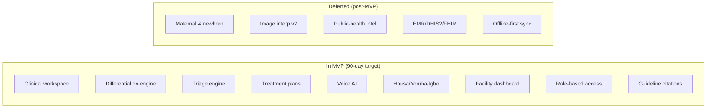

# NouraCDS — Implementation Plan

**Phased build plan for the 90-day MVP and beyond**

Owner: AwaDoc · Status: Design · Audience: Build team

> Companion document: [ARCHITECTURE.md](./ARCHITECTURE.md). This document assumes the architecture defined there ("AI proposes, the deterministic core disposes").

---

## 1. Scope & Strategy

**Strategy: productionize one clinical vertical end-to-end, then widen.**

Rather than build twelve shallow modules at once, we take a single condition — **febrile child under 5** (IMCI) — all the way to production quality across the *entire platform stack* (auth, workspace, AI transport, reasoning, guardrail, observability, documentation). This de-risks every horizontal concern once. Adding the next condition (maternal/neonatal) then becomes "author a new ruleset + corpus slice," not "re-architect."

This directly serves the MVP: the deepest risks (clinical safety, AI gating, RBAC, auditability) are solved on a concrete vertical, and breadth follows on a proven spine.

### Out of scope for MVP (deferred, by prior decision)
- Full offline-first sync and on-device models (online-first + PWA caching only).
- EMR / DHIS2 / FHIR integrations (Phase 2+).
- Image interpretation beyond a thin Phase-1 slice (skin/wounds/rashes) — lab/radiology later.
- Public-health/ministry dashboards beyond facility-level aggregates.

---

## 2. Workstreams



| # | Workstream | Owner profile |
|---|------------|---------------|
| 1 | Platform / Infra | Backend / DevOps |
| 2 | Identity & Access | Backend |
| 3 | Frontend Workspace | Frontend |
| 4 | AI / Transport | ML + Backend |
| 5 | Knowledge / RAG | ML + Clinical |
| 6 | Reasoning + Guardrail | Backend + Clinical |
| 7 | Drug-safety + Docs | Backend + Clinical |
| 8 | Dashboards / Governance | Backend + Frontend |
| 9 | Integrations | Backend |

---

## 3. Phased Roadmap

Small team (FE / BE / ML + clinical lead); 90 days is a **target**, not a hard gate. Phases overlap.



| Phase | Weeks | Theme |
|-------|-------|-------|
| **P0** | 1–2 | Foundations |
| **P1** | 2–4 | Identity & platform |
| **P2** | 3–6 | Frontend workspace (parallel) |
| **P3** | 4–7 | AI transport |
| **P4** | 6–9 | Reasoning + guardrail |
| **P5** | 8–10 | Drug-safety + documentation |
| **P6** | 9–12 | Dashboards + governance |
| **P7** | 10–13 | Integrations + hardening |
| **Widen** | post-MVP | More conditions, image v2, EMR/DHIS2/FHIR, offline-sync |

---

## 4. Per-Phase Detail

### P0 — Foundations (wk 1–2)
- **Objective:** A deployable skeleton with observability and the monorepo in place.
- **Tasks:** monorepo (`apps/`, `packages/`); CI/CD (lint, test, build, container); IaC for envs (dev/staging); Docker Compose for local Mongo/Redis/vector-DB; OpenTelemetry collector + dashboards wired; secrets via env/KMS; base NestJS API + Next.js app booting; port the existing rule engine into `packages/engine` with its tests green.
- **Components:** `apps/api`, `apps/web`, `packages/engine`, `packages/db` (Prisma schema), `infra/`.
- **Acceptance:** CI green; a "hello" trace visible in dashboards; engine unit tests pass in the new package; one-command local bring-up.
- **Risks:** monorepo tooling churn → keep it boring (workspaces, not exotic build systems).

### P1 — Identity & Platform (wk 2–4)
- **Objective:** Authenticated, tenant-scoped, role-aware API.
- **Tasks:** OIDC login; JWT validation at BFF; **RBAC** module map; **scope-of-practice** policy in `packages/engine` (Tier-1, deterministic); multi-tenancy on every model/query; Prisma models for `Tenant/Facility/User/Patient/Encounter`; API gateway/BFF routing + rate-limit.
- **Acceptance:** a nurse JWT is denied a doctor-only action server-side; tenant isolation proven by test; encounters persist immutably with version pins.
- **Risks:** scope rules drifting from clinical reality → clinical lead signs off the role matrix.

### P2 — Frontend Workspace (wk 3–6, parallel)
- **Objective:** The clinical workspace clinicians actually use.
- **Tasks:** Next.js role-based shell rendering only permitted schema sections; encounter flow (intake → review brief → accept/modify → export); multi-modal input UI (text, yes/no buttons, audio capture, image upload); PWA app-shell caching; disposition UI.
- **Acceptance:** doctor and CHEW see different sections for the same patient; full encounter completes against a stubbed backend; works on tablet.
- **Risks:** UX complexity per role → start from the doctor flow, derive others by subtraction.

### P3 — AI Transport (wk 4–7)
- **Objective:** Turn messy human input into validated schema, and outputs into voice/patient language.
- **Tasks:** provider-agnostic **LLM gateway** (`packages/llm-gateway`) with chat/embed/stt/tts/vision + retry/fallback + prompt versioning + token/cost logging; **extraction** service (input → schema, constrained) with strict schema validation (no manual confirm step); extraction + reasoning **caches** (Redis); **voice** (STT/TTS via ElevenLabs/Whisper adapters); **patient-translation** service (clinical → patient-friendly, EN/Hausa/Yoruba/Igbo).
- **Acceptance:** dictated history extracts to a valid DTO that passes schema validation and flows straight to the orchestrator; identical input hits cache; round-trip voice in one Phase-1 language; prompt logs visible (redacted).
- **Risks:** extraction errors → strict schema validation rejects invalid/out-of-range values; low-confidence fields are surfaced on the output for clinician review and caught downstream by the guardrail.

### P4 — Reasoning + Guardrail (wk 6–9)
- **Objective:** The 3-tier reasoning made real and safe.
- **Tasks:** harden the deterministic engine (Tier 2) and red-flag override (Tier 1); build the **Clinical Guardrail Engine** (validate AI output vs red flags, scope, drug safety, citations/confidence); **RAG pipeline** (ingest WHO/IMCI/iCCM/FMOH → chunk → embed → vector DB, corpus versioning); **Tier-3** path producing cited, confidence-scored proposals; orchestrator tier-routing.
- **Acceptance:** febrile-child case returns identical deterministic output 1000×; a Tier-3 proposal that contradicts a red flag is suppressed by the guardrail; every AI item carries a citation + confidence; corpus version pinned in the audit.
- **Risks:** RAG hallucination/poor grounding → answer-only-from-retrieved-passages prompt + guardrail + low-confidence labelling.

### P5 — Drug-Safety + Documentation (wk 8–10)
- **Objective:** Modules useful to every role, low ranking-risk.
- **Tasks:** **Drug Safety Engine** (interactions, contraindications, pregnancy safety, paediatric dosing, duplicate therapy) with a drug database; pharmacist-facing entry point; **documentation** generation (SOAP notes, referral letters, follow-up notes); **PDF export**.
- **Acceptance:** an unsafe interaction is flagged deterministically; a complete encounter generates a SOAP note and a referral PDF; pharmacist role can run interaction checks without diagnosis access.
- **Risks:** drug-DB licensing/coverage → start with a curated essential-meds set aligned to FMOH.

### P6 — Dashboards + Governance (wk 9–12)
- **Objective:** "Every decision monitored" — operationalised.
- **Tasks:** facility dashboard (consultations, common diagnoses, referral rates, triage distribution, user activity, language usage); **eval/regression harness** (golden cases run on every ruleset/model/prompt/corpus bump, blocking promotion); **bias & drift monitoring** (override patterns, subgroup outcomes); audit-review UI.
- **Acceptance:** a ruleset change that regresses a golden case blocks deploy; dashboard reflects live encounters; overrides are queryable for governance review.
- **Risks:** eval coverage gaps → clinical lead curates the golden set per condition.

### P7 — Integrations + Hardening (wk 10–13)
- **Objective:** Pilot-ready.
- **Tasks:** AwaDoc/WhatsApp **patient-context pull** via the adapter interface; security review (authz, tenant isolation, PHI handling, prompt-log redaction); load test the deterministic + AI paths; NDPR/data-residency checklist; pilot runbook.
- **Acceptance:** an existing AwaDoc patient's history loads into an encounter; security review passes; latency/throughput targets met under load.
- **Risks:** external API instability → cache pulled context; degrade gracefully if AwaDoc is unreachable.

### Widen (post-MVP)
Maternal & neonatal rulesets (PRD Module 6) + corpus; image interpretation Phase 2 (lab/radiology); EMR/DHIS2/FHIR; offline-first sync + on-device deterministic core; Phase-2 languages (Pidgin, French, Swahili).

---

## 5. Monorepo Layout

```
nouracds/
├── apps/
│   ├── api/                 # NestJS — BFF, orchestrator, AI service clients
│   └── web/                 # Next.js (PWA) — clinical workspace
├── packages/
│   ├── engine/              # Deterministic core: ranking, safety override,
│   │                        #   predicate evaluator (no eval()), guardrail, scope
│   ├── llm-gateway/         # Provider-agnostic AI access (chat/embed/stt/tts/vision)
│   ├── contracts/           # Shared clinical schema / DTOs (extraction target)
│   └── db/                  # Prisma schema + generated client (MongoDB)
├── rulesets/                # Versioned, immutable ruleset files (per condition)
├── knowledge/              # Guideline corpus + ingestion config (versioned)
└── infra/                   # IaC, Docker/K8s manifests, CI/CD
```

The deterministic `packages/engine` and `packages/contracts` are framework-free so they can run server-side today and on-device later without change.

---

## 6. Mapping to PRD MVP (Release 1)



| PRD item | Module | Phase | MVP status |
|----------|--------|-------|------------|
| Noura Clinical Workspace | 1 | P2 | ✅ In MVP |
| Clinical Reasoning Engine | 2 | P4 | ✅ In MVP |
| Triage Engine | 3 | P4 | ✅ In MVP |
| Treatment Planning | 4 | P4–P5 | ✅ In MVP |
| Drug Safety Engine | 5 | P5 | ✅ In MVP |
| Maternal & Newborn Care | 6 | Widen | ⏭ Deferred |
| Voice AI (EN/Hausa/Yoruba/Igbo) | 7 | P3 | ✅ In MVP |
| Patient Language Translation | 8 | P3 | ✅ In MVP |
| Image Interpretation | 9 | P3 (thin) / Widen | ◑ Partial |
| Documentation Engine | 10 | P5 | ✅ In MVP |
| Facility Dashboard | 11 | P6 | ✅ In MVP |
| Public Health Intelligence | 12 | Widen | ⏭ Deferred |
| Role-Based Access | §6 | P1 | ✅ In MVP |
| Guideline Citations | §8 | P4 | ✅ In MVP |
| AI Governance (audit, prompt log, bias) | §8 | P0/P6 | ✅ In MVP |
| WhatsApp / AwaDoc integration | §7 | P7 | ✅ In MVP |
| EMR / DHIS2 / FHIR | §7 | Widen | ⏭ Deferred |

All **Release-1 deliverables** in PRD §10 are covered within the 90-day target; image interpretation ships as a thin Phase-1 slice with the richer version deferred.

---

## 7. Risks & Mitigations

| Risk | Impact | Mitigation |
|------|--------|------------|
| Clinical safety (wrong escalation/dose) | Patient harm, liability | Tier-1 deterministic safety the LLM cannot override; clinical sign-off on rulesets; eval harness blocks regressions |
| LLM hallucination | Misleading advice | RAG answer-only-from-passages; guardrail gating; confidence labels; human-in-the-loop |
| RAG grounding quality | Low-value Tier-3 | Curated, versioned corpus; filtered retrieval; citation requirement; low-confidence suppression |
| Scope-of-practice gaps | Out-of-scope actions surfaced | Deterministic scope gate, server-enforced; clinical-lead role matrix |
| AI cost/latency | Cost overrun, slow UX | Extraction + reasoning caching; deterministic path is free/instant; gateway cost logging + budgets |
| NDPR / PHI exposure | Legal, trust | Encryption, redacted prompt logs, in-region residency, least-privilege |
| Scope creep (12 modules) | Missed 90 days | Vertical-first; explicit deferral list; phase acceptance gates |
| Single→multi-condition generalization | Re-work | Ruleset registry + corpus design proven on condition #1 before widening |

---

## 8. Staffing & Hiring Needs

| Need | Covered by small team? | Gap / action |
|------|------------------------|--------------|
| Backend / platform | Yes | — |
| Frontend | Yes | — |
| ML (gateway, extraction, RAG) | Partly | May need RAG/eval specialist time |
| Clinical content authoring | Clinical lead | Needs an **advisory board** to sign off rulesets per PRD governance |
| Security / compliance review | No | Engage a security reviewer before pilot (P7) |
| Clinical evals / QA | Partly | Clinical lead curates golden cases; consider QA support as conditions widen |

---

## 9. Definition of Done / Launch Readiness

A condition is **launch-ready** when:

- [ ] Ruleset reviewed and signed off by the clinical advisory board; provenance recorded.
- [ ] Deterministic output is reproducible (golden cases, 1000× determinism check).
- [ ] Every AI output is gated by the guardrail and labelled with citations + confidence.
- [ ] Scope-of-practice enforced server-side for all roles (tested per role).
- [ ] Eval/regression harness green; promotion blocked on any regression.
- [ ] Audit completeness: every encounter pins ruleset/model/prompt/corpus versions; disposition append-only.
- [ ] Observability: traces, prompt logs (redacted), and dashboards cover the full path.
- [ ] Security review passed; NDPR/data-residency checklist complete.
- [ ] PWA verified on target devices; graceful degradation when AI/integrations unreachable.

---

*See [ARCHITECTURE.md](./ARCHITECTURE.md) for the system design these phases implement.*
